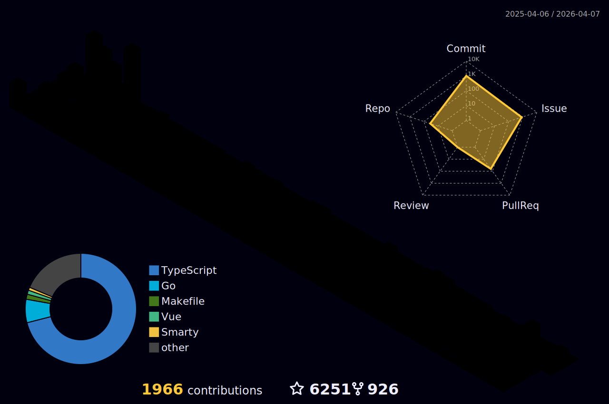

### 👋 Hi there

<div align="center">

[](https://git.io/typing-svg)


</div>


有时候想象自己并不是一个IT男，尽管身处IT工作之中，但是更多时候却又喜欢以一种跳出去回望这个群体的样子，常常别有一番滋味。

曾经在高中的时候，酷爱读书，读《论语》的时候看到这样一则故事：司马牛忧曰："人皆有兄弟，我独亡！"子夏曰："商闻之矣：死生有命，富贵在天。君子敬而无失，与人恭而有礼，四海之内，皆兄弟也。君子何患乎无兄弟也？"（司马牛担忧地说："别人都有兄弟，只有我没有。"子夏说："我听说过：`死生有命，富贵在天`，君子只要严肃认真地对待所做的事情，不出过失，对人恭敬而合乎于礼的规定，那`天下人就都是自家兄弟`。君子何愁没有兄弟呢？"）

而我，在这样一个伟大的时代中，与司马牛是一样的，在没看到四海皆兄弟这个概念之前也与司马牛一样有过类似忧虑。但是彼时就是这么一句话，瞬间点醒一个人，让我的心境进入到另一种天地。

讲个小故事，大概简单想表达几个简单意思：

- 1，古代朱子有云：`天不生仲尼，万古如长夜`，虽然现在距离孔子时代过去两千多年，但是对圣人的敬仰，感恩之心情，永不更易。这是对自己的要求，信而好古，永远秉持发扬优良传统文化，不亦快哉！
- 2，人的痛苦很大部分来源于`迷`（愚痴），而真心谛听的往往阅经猛醒，以致破迷开悟，离苦得乐。希望自己认真做一个传承者，学到的，内化的，分享的，与人有益，幸甚！
- 3，我也是一个喜欢交友的人，对待任何一个熟悉的陌生的，都“恭而有礼”，也希望借此能够结交更多的朋友。

### 🤗 欢迎来访


[](https://visitor-badge.laobi.icu/badge?page_id=eryajf.eryajf)
[](mailto:eryajf@163.com)
[](https://github-readme-stats.vercel.app/api?username=eryajf&hide_title=false&hide_border=true&show_icons=true&include_all_commits=true&line_height=20&bg_color=0,EC6C6C,FFD479,FFFC79,73FA79&theme=graywhite&locale=cn)
[](https://github.com/eryajf?tab=followers)
[](https://tva4.sinaimg.cn/large/008k1Yt0ly1h4nmsb1pgzj32n00yo154.jpg)
[](https://wiki.eryajf.net)
[](https://github.com/eryajf/awesome-stars-eryajf#readme)


### 🧰 语言工具

<a href="https://github.com" target="_blank">  </a><a href="https://apple.com" target="_blank">  </a><a href="https://www.gnu.org/software/bash/" target="_blank">  </a><a href="https://www.markdownguide.org/" target="_blank">  </a><a href="https://www.centos.org/" target="_blank">  </a><a href="https://www.vim.org/" target="_blank">  </a><a href="https://github.com/golang/go" target="_blank">  </a><a href="https://cn.vuejs.org/index.html" target="_blank">  </a> <a href="https://groovy-lang.org/" target="_blank">  </a> <a href="https://www.linux.org/" target="_blank">  </a> <a href="https://www.docker.com/" target="_blank">  </a> <a href="https://kubernetes.io" target="_blank">  </a> <a href="https://www.elastic.co" target="_blank">  </a> <a href="https://git-scm.com/" target="_blank">  </a> <a href="https://grafana.com" target="_blank">  </a> <a href="https://www.jenkins.io" target="_blank">  </a> <a href="https://www.mongodb.com/" target="_blank">  </a>
<a href="https://www.mysql.com/" target="_blank">  </a><a href="https://www.nginx.com" target="_blank">  </a><a href="https://apifox.cn" target="_blank">  </a><a href="https://typora.io" target="_blank">  </a><a href="https://code.visualstudio.com/" target="_blank">  </a><a href="https://obsidian.md/" target="_blank">  </a><a href="https://www.jianguoyun.com/" target="_blank">  </a> <a href="https://u.tools" target="_blank">  </a><a href="https://www.sonatype.com/" target="_blank">  </a><a href="https://www.ansible.com/" target="_blank">  </a><a href="https://prometheus.io/" target="_blank">  </a> <a href="https://github.com/ripperhe/Bob" target="_blank">  </a><a href="https://www.google.com/chrome/" target="_blank">  </a>


### 💻 Stats

<details open>
<summary>点击展开 ...</summary>

<div align="center">


[](https://github-readme-stats.vercel.app/api?username=eryajf&hide_title=false&hide_border=true&show_icons=true&include_all_commits=true&line_height=20&bg_color=0,EC6C6C,FFD479,FFFC79,73FA79&theme=graywhite&locale=cn)[](https://github-readme-stats.vercel.app/api/top-langs/?username=eryajf&hide_title=false&hide=c&hide_border=true&layout=compact&bg_color=0,73FA79,73FDFF,D783FF&theme=graywhite&locale=cn)

[](https://github-profile-trophy.vercel.app/?username=eryajf&theme=algolia&column=8)

[](https://raw.githubusercontent.com/eryajf/eryajf/master/assets/github-contribution-grid-snake.svg)
[](https://raw.githubusercontent.com/eryajf/eryajf/master/profile-3d-contrib/profile-night-rainbow.svg)

[](https://activity-graph.herokuapp.com/graph?username=eryajf&theme=github)

</div>

</details>

### 🏊 更多仓库

<details open>
<summary>点击展开 ...</summary>

|                        Project                         |                            Stars                              |                            Forks                             |              Remark              |
| :----------------------------------------------------: | :----------------------------------------------------------: | :----------------------------------------------------------: | :------------------------------: |
| [docker_learn](https://github.com/eryajf/docker_learn) |  |  | 学习docker过程中所用到的一些东东 |
| [shellabout](https://github.com/eryajf/shellabout) |   |  | 一些值得珍藏的脚本  |
| [magic-of-kubernetes-scripts](https://github.com/eryajf/magic-of-kubernetes-scripts) |  |  | 一键部署k8s-1.10.4高可用集群  |
| [magic-of-sysuse-scripts](https://github.com/eryajf/magic-of-sysuse-scripts) |  |  | 运维外挂，运维脚本的新角度  |
| [care-screenshot](https://github.com/eryajf/care-screenshot) |   |  | 将你关心的网页元素截图发给机器人  |
| [rpmbuild](https://github.com/eryajf/rpmbuild) |   |  | 整理工作中常用的RPM构建spec  |
| [learning-weekly](https://github.com/eryajf/learning-weekly) |  |  | 学习周刊，开源项目,优秀博客  |
| [xirang](https://github.com/eryajf/xirang) |  |  | 简单好用，直接上手的go-web框架后端  |
| [xirang-ui](https://github.com/eryajf/xirang-ui) |  |  | 简单好用，直接上手的go-web框架前端  |
| [eryajf.github.io](https://github.com/eryajf/eryajf.github.io) |  |  | 当前博客全部源码  |
| [Obsidian-Plugin-Weekly](https://github.com/eryajf/Obsidian-Plugin-Weekly) |  |  | 📝 Obsidian插件周刊  |
| [ldapctl](https://github.com/eryajf/ldapctl) |   |  | OpenLDAP Controller  |
| [Thanks-Mirror](https://github.com/eryajf/Thanks-Mirror) |  |  | 各个包管理器，系统镜像，以及常用软件的镜像  |
| [go-ldap-admin-ui](https://github.com/eryajf/go-ldap-admin-ui) |  |  | 基于Go+Vue实现的openLDAP后台管理项目  |
| [go-ldap-admin](https://github.com/eryajf/go-ldap-admin) |  |  | 基于Go+Vue实现的openLDAP后台管理项目  |
| [go-ldap-admin-doc](https://github.com/eryajf/go-ldap-admin-doc) |  |  | go-ldap-admin项目官方文档  |
| [third-tools](https://github.com/eryajf/third-tools) |  |  | 🧰 Go三方工具简单入门使用合集  |
| [read-list](https://github.com/eryajf/read-list) |  |  | 优质内容订阅，阅读方为根本  |
| [HowToStartOpenSource](https://github.com/eryajf/HowToStartOpenSource) |  |  | GitHub开源项目维护指南  |
| [vdoing-template](https://github.com/eryajf/vdoing-template) |  |  |  vdoing博客主题模板   |
| [awesome-github-profile-readme-chinese](https://github.com/eryajf/awesome-github-profile-readme-chinese) |  |  | 🦩 优秀的中文区个人主页搜集  |
| [awesome-stars-eryajf](https://github.com/eryajf/awesome-stars-eryajf) |  |  | 🤩 我的star列表，每天凌晨自动更新  |
| [recommend-actions](https://github.com/eryajf/recommend-actions) |  |  | 优秀的GitHub Actions推荐  |
| [awesome-navigation](https://github.com/eryajf/awesome-navigation) |  |  | 优秀的导航项目以及导航站合集  |
| [ldapool](https://github.com/eryajf/ldapool) |  |  | go-ldap库的连接池实现  |
| [gojenkins](https://github.com/eryajf/gojenkins) |  |  | fork自gojenkins,增加了很多功能  |
| [chatgpt-dingtalk](https://github.com/eryajf/chatgpt-dingtalk) |  |  | chatGPT机器人在钉钉群聊中交互  |


### 📝 博客最近更新

<details open>
<summary>点击展开 ...</summary>


<!-- BLOG-POST-LIST:START -->
- 🐻 [学习周刊-总第90期-2023年第03周](https://wiki.eryajf.net/pages/0af1da/) 

- 🎃 [学习周刊-总第89期-2023年第02周](https://wiki.eryajf.net/pages/0401bb/) 

- 🚀 [学习周刊-总第88期-2023年第01周](https://wiki.eryajf.net/pages/1e5ab8/) 

- 🌋 [学习周刊-总第87期-2022年第52周](https://wiki.eryajf.net/pages/ba509d/) 

- 🌁 [我的2022年](https://wiki.eryajf.net/pages/813b7b/) 

- 😺 [学习周刊-总第86期-2022年第51周](https://wiki.eryajf.net/pages/f86f4e/) 
<!-- BLOG-POST-LIST:END -->

更多内容直接点击：[https://wiki.eryajf.net](https://wiki.eryajf.net)

</details>

### ☄️ 其他动态

<details open>
<summary>点击展开 ...</summary>

<table align="center">
<tr>
<td valign="top">

<!--START_SECTION:waka-->
**I'm an Early 🐤** 

```text
🌞 Morning    318 commits    ███████░░░░░░░░░░░░░░░░░░   31.02% 
🌆 Daytime    314 commits    ███████░░░░░░░░░░░░░░░░░░   30.63% 
🌃 Evening    257 commits    ██████░░░░░░░░░░░░░░░░░░░   25.07% 
🌙 Night      136 commits    ███░░░░░░░░░░░░░░░░░░░░░░   13.27%

```
📅 **I'm Most Productive on Thursday** 

```text
Monday       129 commits    ███░░░░░░░░░░░░░░░░░░░░░░   12.59% 
Tuesday      141 commits    ███░░░░░░░░░░░░░░░░░░░░░░   13.76% 
Wednesday    199 commits    ████░░░░░░░░░░░░░░░░░░░░░   19.41% 
Thursday     204 commits    █████░░░░░░░░░░░░░░░░░░░░   19.9% 
Friday       130 commits    ███░░░░░░░░░░░░░░░░░░░░░░   12.68% 
Saturday     99 commits     ██░░░░░░░░░░░░░░░░░░░░░░░   9.66% 
Sunday       123 commits    ███░░░░░░░░░░░░░░░░░░░░░░   12.0%

```


📊 **This Week I Spent My Time On** 

```text
⌚︎ Time Zone: Asia/Shanghai

💬 Programming Languages: 
Vue.js                   30 mins             ███████████░░░░░░░░░░░░░░   46.62% 
JavaScript               17 mins             ██████░░░░░░░░░░░░░░░░░░░   26.22% 
Go                       10 mins             ████░░░░░░░░░░░░░░░░░░░░░   15.65% 
Markdown                 7 mins              ██░░░░░░░░░░░░░░░░░░░░░░░   10.92% 
YAML                     0 secs              ░░░░░░░░░░░░░░░░░░░░░░░░░   0.59%

🔥 Editors: 
VS Code                  1 hr 6 mins         █████████████████████████   100.0%

💻 Operating System: 
Mac                      1 hr 6 mins         █████████████████████████   100.0%

```


 Last Updated on 27/01/2023 05:41:38 UTC
<!--END_SECTION:waka-->

</td>
</tr>
</table>

</details>

### :basecampy: GitHub最近动态

<details open>
<summary>点击展开 ...</summary>

<table align="center">
<tr>
<td valign="top">

<!--START_SECTION:activity-->
1. 🎉 Merged PR [#146](https://github.com/eryajf/go-ldap-admin/pull/146) in [eryajf/go-ldap-admin](https://github.com/eryajf/go-ldap-admin)
2. 💪 Opened PR [#146](https://github.com/eryajf/go-ldap-admin/pull/146) in [eryajf/go-ldap-admin](https://github.com/eryajf/go-ldap-admin)
3. 🗣 Commented on [#12](https://github.com/eryajf/chatgpt-dingtalk/issues/12) in [eryajf/chatgpt-dingtalk](https://github.com/eryajf/chatgpt-dingtalk)
4. 🗣 Commented on [#2](https://github.com/eryajf/go-ldap-admin-doc/issues/2) in [eryajf/go-ldap-admin-doc](https://github.com/eryajf/go-ldap-admin-doc)
5. ❗️ Closed issue [#143](https://github.com/eryajf/go-ldap-admin/issues/143) in [eryajf/go-ldap-admin](https://github.com/eryajf/go-ldap-admin)
6. 🗣 Commented on [#143](https://github.com/eryajf/go-ldap-admin/issues/143) in [eryajf/go-ldap-admin](https://github.com/eryajf/go-ldap-admin)
<!--END_SECTION:activity-->

</td>
</tr>
</table>

</details>

### 🎸 最近在听音乐

<details open>
<summary>点击展开 ...</summary>

<table align="center">
<tr>
<td valign="top">

[](https://music.163.com/#/user/home?id=316286554)

</td>
</tr>
</table>

</details>

### 🦚 B站与知乎

<details open>
<summary>点击展开 ...</summary>

<div align="center">

[](https://space.bilibili.com/237149104)
[](https://www.zhihu.com/people/eryajf)
</div>

</details>


### 🎡 关注我的大佬

> 😘 Thank you follow me!

<details>
<summary>点击展开 ...</summary>

<!--ACTION_START_FLAG:github-followers-->
<table>
  <tr>
    <td align="center">
        <a href="https://github.com/esin">
            
        </a>
        <br />
        <a href="https://github.com/esin">Andrey Esin</a>
    </td>
    <td align="center">
        <a href="https://github.com/cumsoft">
            
        </a>
        <br />
        <a href="https://github.com/cumsoft">Cumsoft™</a>
    </td>
    <td align="center">
        <a href="https://github.com/AYIDouble">
            
        </a>
        <br />
        <a href="https://github.com/AYIDouble">Alpay Yildirim</a>
    </td>
    <td align="center">
        <a href="https://github.com/qianguyihao">
            
        </a>
        <br />
        <a href="https://github.com/qianguyihao">千古壹号</a>
    </td>
    <td align="center">
        <a href="https://github.com/crazylxr">
            
        </a>
        <br />
        <a href="https://github.com/crazylxr">lxr</a>
    </td>
    <td align="center">
        <a href="https://github.com/sbilly">
            
        </a>
        <br />
        <a href="https://github.com/sbilly">sbilly</a>
    </td>
    <td align="center">
        <a href="https://github.com/hoochanlon">
            
        </a>
        <br />
        <a href="https://github.com/hoochanlon">冻柠茶配菠萝包</a>
    </td>
  </tr>
  <tr>
    <td align="center">
        <a href="https://github.com/li-jia-nan">
            
        </a>
        <br />
        <a href="https://github.com/li-jia-nan">lijianan</a>
    </td>
    <td align="center">
        <a href="https://github.com/guanguans">
            
        </a>
        <br />
        <a href="https://github.com/guanguans">guanguans</a>
    </td>
    <td align="center">
        <a href="https://github.com/fengjixuchui">
            
        </a>
        <br />
        <a href="https://github.com/fengjixuchui">fengjixuchui</a>
    </td>
    <td align="center">
        <a href="https://github.com/adsian">
            
        </a>
        <br />
        <a href="https://github.com/adsian">Roger</a>
    </td>
    <td align="center">
        <a href="https://github.com/teamssix">
            
        </a>
        <br />
        <a href="https://github.com/teamssix">TeamsSix</a>
    </td>
    <td align="center">
        <a href="https://github.com/sudoskys">
            
        </a>
        <br />
        <a href="https://github.com/sudoskys">Jasmine</a>
    </td>
    <td align="center">
        <a href="https://github.com/wuchunfu">
            
        </a>
        <br />
        <a href="https://github.com/wuchunfu">ChunFuWu</a>
    </td>
  </tr>
  <tr>
    <td align="center">
        <a href="https://github.com/penndu">
            
        </a>
        <br />
        <a href="https://github.com/penndu">TeacherDu</a>
    </td>
    <td align="center">
        <a href="https://github.com/kxxt">
            
        </a>
        <br />
        <a href="https://github.com/kxxt">Levi Zim</a>
    </td>
    <td align="center">
        <a href="https://github.com/wangrongding">
            
        </a>
        <br />
        <a href="https://github.com/wangrongding">荣顶</a>
    </td>
    <td align="center">
        <a href="https://github.com/xiaoxuan6">
            
        </a>
        <br />
        <a href="https://github.com/xiaoxuan6">xiaoxuan6</a>
    </td>
    <td align="center">
        <a href="https://github.com/puzzithinker">
            
        </a>
        <br />
        <a href="https://github.com/puzzithinker">Simon Leung</a>
    </td>
    <td align="center">
        <a href="https://github.com/anzhihe">
            
        </a>
        <br />
        <a href="https://github.com/anzhihe">安志合</a>
    </td>
    <td align="center">
        <a href="https://github.com/maxcohen31">
            
        </a>
        <br />
        <a href="https://github.com/maxcohen31">Emanuele</a>
    </td>
  </tr>
</table>
<!--ACTION_END_FLAG:github-followers-->

