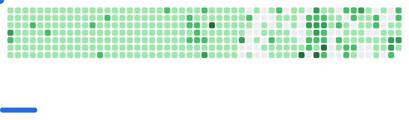
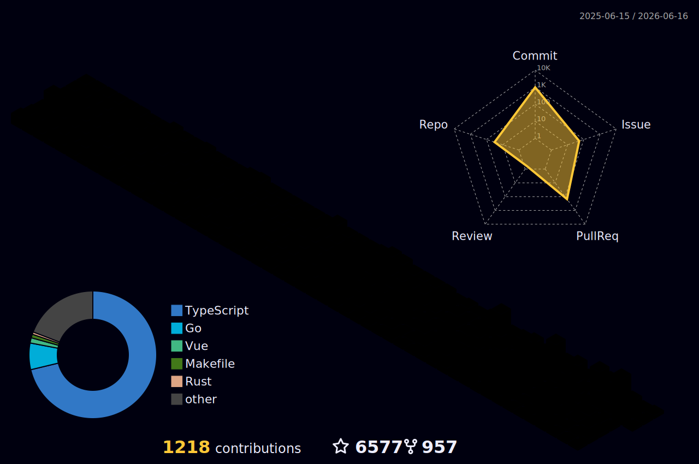

### 👋 Hi there

有时候想象自己并不是一个IT男，尽管身处IT工作之中，但是更多时候却又喜欢以一种跳出去回望这个群体的样子，常常别有一番滋味。

曾经在高中的时候，酷爱读书，读《论语》的时候看到这样一则故事：司马牛忧曰："人皆有兄弟，我独亡！"子夏曰："商闻之矣：死生有命，富贵在天。君子敬而无失，与人恭而有礼，四海之内，皆兄弟也。君子何患乎无兄弟也？"（司马牛担忧地说："别人都有兄弟，只有我没有。"子夏说："我听说过：`死生有命，富贵在天`，君子只要严肃认真地对待所做的事情，不出过失，对人恭敬而合乎于礼的规定，那`天下人就都是自家兄弟`。君子何愁没有兄弟呢？"）

而我，在这样一个伟大的时代中，与司马牛是一样的，在没看到四海皆兄弟这个概念之前也与司马牛一样有过类似忧虑。但是彼时就是这么一句话，瞬间点醒一个人，让我的心境进入到另一种天地。

讲个小故事，大概简单想表达几个简单意思：

- 1，古代朱子有云：`天不生仲尼，万古如长夜`，虽然现在距离孔子时代过去两千多年，但是对圣人的敬仰，感恩之心情，永不更易。这是对自己的要求，信而好古，永远秉持发扬优良传统文化，不亦快哉！
- 2，人的痛苦很大部分来源于`迷`（愚痴），而真心谛听的往往阅经猛醒，以致破迷开悟，离苦得乐。希望自己认真做一个传承者，学到的，内化的，分享的，与人有益，幸甚！
- 3，我也是一个喜欢交友的人，对待任何一个熟悉的陌生的，都"恭而有礼"，也希望借此能够结交更多的朋友。

### 🤗 欢迎来访

>

 
>[![Auth](https://img.shields.io/badge/Auther--eryajf-ff69b4.svg?logo=)](https://github.com/eryajf)

### 🧰 语言工具

>

### 💻 Stats

点击展开 ...

<picture>
  <source
    media="(prefers-color-scheme: dark)"
    srcset="images/breakout-dark.svg"
  />
  <source
    media="(prefers-color-scheme: light)"
    srcset="images/breakout-light.svg"
  />
  
</picture>

### 🏊 更多仓库

点击展开 ...

|                        Project                         |                            Stars                              |                            Forks                             |              Remark              |
| :----------------------------------------------------: | :----------------------------------------------------------: | :----------------------------------------------------------: | :------------------------------: |
| [docker_learn](https://github.com/eryajf/docker_learn) |  |  | 学习docker过程中所用到的一些东东 |
| [shellabout](https://github.com/eryajf/shellabout) |   |  | 一些值得珍藏的脚本  |
| [magic-of-kubernetes-scripts](https://github.com/eryajf/magic-of-kubernetes-scripts) |  |  | 一键部署k8s-1.10.4高可用集群  |
| [magic-of-sysuse-scripts](https://github.com/eryajf/magic-of-sysuse-scripts) |  |  | 运维外挂，运维脚本的新角度  |
| [care-screenshot](https://github.com/eryajf/care-screenshot) |   |  | 将你关心的网页元素截图发给机器人  |
| [rpmbuild](https://github.com/eryajf/rpmbuild) |   |  | 整理工作中常用的RPM构建spec  |
| [learning-weekly](https://github.com/eryajf/learning-weekly) |  |  | 学习周刊，开源项目,优秀博客  |
| [xirang](https://github.com/eryajf/xirang) |  |  | 简单好用，直接上手的go-web框架后端  |
| [xirang-ui](https://github.com/eryajf/xirang-ui) |  |  | 简单好用，直接上手的go-web框架前端  |
| [Obsidian-Plugin-Weekly](https://github.com/eryajf/Obsidian-Plugin-Weekly) |  |  | 📝 Obsidian插件周刊  |
| [ldapctl](https://github.com/eryajf/ldapctl) |   |  | OpenLDAP Controller  |
| [Thanks-Mirror](https://github.com/eryajf/Thanks-Mirror) |  |  | 各个包管理器，系统镜像，以及常用软件的镜像  |
| [go-ldap-admin-ui](https://github.com/eryajf/go-ldap-admin-ui) |  |  | 基于Go+Vue实现的openLDAP后台管理项目  |
| [go-ldap-admin](https://github.com/eryajf/go-ldap-admin) |  |  | 基于Go+Vue实现的openLDAP后台管理项目  |
| [go-ldap-admin-doc](https://github.com/eryajf/go-ldap-admin-doc) |  |  | go-ldap-admin项目官方文档  |
| [third-tools](https://github.com/eryajf/third-tools) |  |  | 🧰 Go三方工具简单入门使用合集  |
| [read-list](https://github.com/eryajf/read-list) |  |  | 优质内容订阅，阅读方为根本  |
| [HowToStartOpenSource](https://github.com/eryajf/HowToStartOpenSource) |  |  | GitHub开源项目维护指南  |
| [vdoing-template](https://github.com/eryajf/vdoing-template) |  |  |  vdoing博客主题模板   |
| [awesome-github-profile-readme-chinese](https://github.com/eryajf/awesome-github-profile-readme-chinese) |  |  | 🦩 优秀的中文区个人主页搜集  |
| [awesome-stars-eryajf](https://github.com/eryajf/awesome-stars-eryajf) |  |  | 🤩 我的star列表，每天凌晨自动更新  |
| [recommend-actions](https://github.com/eryajf/recommend-actions) |  |  | 优秀的GitHub Actions推荐  |
| [awesome-navigation](https://github.com/eryajf/awesome-navigation) |  |  | 优秀的导航项目以及导航站合集  |
| [ldapool](https://github.com/eryajf/ldapool) |  |  | go-ldap库的连接池实现  |
| [gojenkins](https://github.com/eryajf/gojenkins) |  |  | fork自gojenkins,增加了很多功能  |
| [chatgpt-dingtalk](https://github.com/eryajf/chatgpt-dingtalk) |  |  | chatGPT机器人在钉钉群聊中交互  |
| [emotion_generate](https://github.com/eryajf/emotion_generate) |  |  | Artalk评论系统的表情包  |
| [awesome-chatgpt-answer](https://github.com/eryajf/awesome-chatgpt-answer) |  |  | 🙋 问得好，🗣 答得妙。  |
| [eryajf-dockerfile](https://github.com/eryajf/eryajf-dockerfile) |  |  | 🏺 个人常用的Docker镜像汇总  |
| [eryajfctl](https://github.com/eryajf/eryajfctl) |  |  | 🚀 基于Cobra库快速打造类似kubectl一样的命令行工具箱 🧰  |
| [cloudctl](https://github.com/eryajf/cloudctl) |  |  | 🚀 与公有云等交互的命令行工具 🧰  |
| [chatgpt-wecom](https://github.com/eryajf/chatgpt-wecom) |  |  | 💬 基于GO语言实现的体验最好的企微应用集成ChatGPT项目 🚀  |
| [gitlabCodeSearch](https://github.com/eryajf/gitlabCodeSearch) |  |  | 🔎 使用关键字搜索所有gitlab项目 |
| [awesome-ops](https://github.com/eryajf/awesome-ops) |  |  | 🧰 记录每一个与运维相关的优秀项目 |
| [promwrite](https://github.com/eryajf/promwrite) |  |  | 📹 Prometheus Remote Write GO 库 |
| [glactl](https://github.com/eryajf/glactl) |  |  | 🛠 go-ldap-admin 项目对应的IM测试工具 |
| [langchaingo-ollama-rag](https://github.com/eryajf/langchaingo-ollama-rag) |  |  | 📖 学习基于langchaingo结合ollama实现的rag应用流程 |
| [cloud_dns_exporter](https://github.com/eryajf/cloud_dns_exporter) |  |  | 🧰 自动获取DNS提供商的域名及解析列表，同时自动获取每个域名解析的证书信息。 |
| [go-enterprise-email-sdk](https://github.com/eryajf/go-enterprise-email-sdk) |  |  | 💌 阿里企业邮箱 GO 语言 SDK 📬 |
| [JenkinsGuide](https://github.com/opsre/JenkinsGuide) |  |  | 📜 Jenkins全知全解。 |
| [awesome-utools-plugins](https://github.com/eryajf/awesome-utools-plugins) |  |  | 🦄 汇集优秀的uTools开源插件 |
| [ZenOps](https://github.com/eryajf/ZenOps) |  |  | 🧘 通过钉钉、飞书、企微智能机器人用自然语言查询运维资源的工具 |
| [learn-skills](https://github.com/eryajf/learn-skills) |  |  | 🙇 与其 awesome skills，不如 learn a skill |

### 📝 博客最近更新

点击展开 ...

<!-- BLOG-POST-LIST:START -->
- 🐻 [学习周刊-总第258期-2026年第15周](https://wiki.eryajf.net/pages/323cfa/) 

- 🎃 [学习周刊-总第257期-2026年第14周](https://wiki.eryajf.net/pages/22ef3d/) 

- 🚀 [学习周刊-总第256期-2026年第13周](https://wiki.eryajf.net/pages/f71cfa/) 

- 🌋 [学习周刊-总第255期-2026年第12周](https://wiki.eryajf.net/pages/5f9192/) 

- 🌁 [我的2025年](https://wiki.eryajf.net/pages/1b0fca/) 

- 😺 [学习周刊-总第254期-2026年第11周](https://wiki.eryajf.net/pages/41978b/) 
<!-- BLOG-POST-LIST:END -->

更多内容直接点击：[https://wiki.eryajf.net](https://wiki.eryajf.net)

### 🥇 Badges

<!-- my-badges start -->

<!-- my-badges end -->

