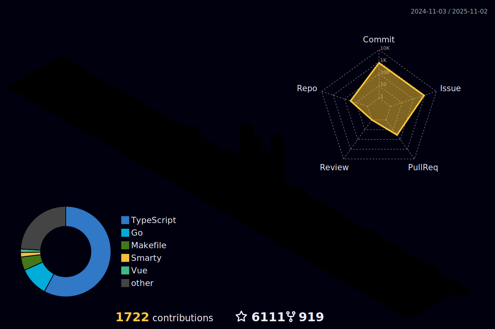

### 👋 Hi there

<div align="center">

[](https://git.io/typing-svg)


</div>


有时候想象自己并不是一个IT男，尽管身处IT工作之中，但是更多时候却又喜欢以一种跳出去回望这个群体的样子，常常别有一番滋味。

曾经在高中的时候，酷爱读书，读《论语》的时候看到这样一则故事：司马牛忧曰："人皆有兄弟，我独亡！"子夏曰："商闻之矣：死生有命，富贵在天。君子敬而无失，与人恭而有礼，四海之内，皆兄弟也。君子何患乎无兄弟也？"（司马牛担忧地说："别人都有兄弟，只有我没有。"子夏说："我听说过：`死生有命，富贵在天`，君子只要严肃认真地对待所做的事情，不出过失，对人恭敬而合乎于礼的规定，那`天下人就都是自家兄弟`。君子何愁没有兄弟呢？"）

而我，在这样一个伟大的时代中，与司马牛是一样的，在没看到四海皆兄弟这个概念之前也与司马牛一样有过类似忧虑。但是彼时就是这么一句话，瞬间点醒一个人，让我的心境进入到另一种天地。

讲个小故事，大概简单想表达几个简单意思：

- 1，古代朱子有云：`天不生仲尼，万古如长夜`，虽然现在距离孔子时代过去两千多年，但是对圣人的敬仰，感恩之心情，永不更易。这是对自己的要求，信而好古，永远秉持发扬优良传统文化，不亦快哉！
- 2，人的痛苦很大部分来源于`迷`（愚痴），而真心谛听的往往阅经猛醒，以致破迷开悟，离苦得乐。希望自己认真做一个传承者，学到的，内化的，分享的，与人有益，幸甚！
- 3，我也是一个喜欢交友的人，对待任何一个熟悉的陌生的，都“恭而有礼”，也希望借此能够结交更多的朋友。

### 🤗 欢迎来访


[](https://visitor-badge.laobi.icu/badge?page_id=eryajf.eryajf)
[](mailto:eryajf@163.com)
[](https://github-readme-stats.vercel.app/api?username=eryajf&hide_title=false&hide_border=true&show_icons=true&include_all_commits=true&line_height=20&bg_color=0,EC6C6C,FFD479,FFFC79,73FA79&theme=graywhite&locale=cn)
[](https://github.com/eryajf?tab=followers)
[](https://tva4.sinaimg.cn/large/008k1Yt0ly1h4nmsb1pgzj32n00yo154.jpg)
[](https://wiki.eryajf.net)
[](https://github.com/eryajf/awesome-stars-eryajf#readme)


### 🧰 语言工具

<a href="https://github.com" target="_blank">  </a><a href="https://apple.com" target="_blank">  </a><a href="https://www.gnu.org/software/bash/" target="_blank">  </a><a href="https://www.markdownguide.org/" target="_blank">  </a><a href="https://www.centos.org/" target="_blank">  </a><a href="https://www.vim.org/" target="_blank">  </a><a href="https://github.com/golang/go" target="_blank">  </a><a href="https://cn.vuejs.org/index.html" target="_blank">  </a> <a href="https://groovy-lang.org/" target="_blank">  </a> <a href="https://www.linux.org/" target="_blank">  </a> <a href="https://www.docker.com/" target="_blank">  </a> <a href="https://kubernetes.io" target="_blank">  </a> <a href="https://www.elastic.co" target="_blank">  </a> <a href="https://git-scm.com/" target="_blank">  </a> <a href="https://grafana.com" target="_blank">  </a> <a href="https://www.jenkins.io" target="_blank">  </a> <a href="https://www.mongodb.com/" target="_blank">  </a>
<a href="https://www.mysql.com/" target="_blank">  </a><a href="https://www.nginx.com" target="_blank">  </a><a href="https://apifox.cn" target="_blank">  </a><a href="https://typora.io" target="_blank">  </a><a href="https://code.visualstudio.com/" target="_blank">  </a><a href="https://obsidian.md/" target="_blank">  </a><a href="https://www.jianguoyun.com/" target="_blank">  </a> <a href="https://u.tools" target="_blank">  </a><a href="https://www.sonatype.com/" target="_blank">  </a><a href="https://www.ansible.com/" target="_blank">  </a><a href="https://prometheus.io/" target="_blank">  </a> <a href="https://github.com/ripperhe/Bob" target="_blank">  </a><a href="https://www.google.com/chrome/" target="_blank">  </a>


### 💻 Stats

<details open>
<summary>点击展开 ...</summary>

<div align="center">


[](https://github-readme-stats.vercel.app/api?username=eryajf&hide_title=false&hide_border=true&show_icons=true&include_all_commits=true&line_height=20&bg_color=0,EC6C6C,FFD479,FFFC79,73FA79&theme=graywhite&locale=cn)[](https://github-readme-stats.vercel.app/api/top-langs/?username=eryajf&hide_title=false&hide=c&hide_border=true&layout=compact&bg_color=0,73FA79,73FDFF,D783FF&theme=graywhite&locale=cn)

[](https://github-profile-trophy.vercel.app/?username=eryajf&theme=algolia&column=8)

[](https://raw.githubusercontent.com/eryajf/eryajf/master/assets/github-contribution-grid-snake.svg)
[](https://raw.githubusercontent.com/eryajf/eryajf/master/profile-3d-contrib/profile-night-rainbow.svg)

[](https://activity-graph.herokuapp.com/graph?username=eryajf&theme=github)

</div>

</details>

### 🏊 更多仓库

<details open>
<summary>点击展开 ...</summary>

[](https://github.com/eryajf/ldapctl)
[](https://github.com/eryajf/rpmbuild)
[](https://github.com/eryajf/shellabout)
[](https://github.com/eryajf/docker_learn)
[](https://github.com/eryajf/xirang)
[](https://github.com/eryajf/care-screenshot)
[](https://github.com/eryajf/magic-of-kubernetes-scripts)
[](https://github.com/eryajf/read-list)
[](https://github.com/eryajf/go-ldap-admin-ui)
[](https://github.com/eryajf/thirdIM)
[](https://github.com/eryajf/go-ldap-admin-doc)
[](https://github.com/eryajf/vdoing-template)
[](https://github.com/eryajf/awesome-github-profile-readme-chinese)
[](https://github.com/eryajf/awesome-stars-eryajf)
[](https://github.com/eryajf/Obsidian-Plugin-Weekly)

</details>

### 🎡 关注我的大佬

> 😘 Thank you follow me!

<details open>
<summary>点击展开 ...</summary>

<!--ACTION_START_FLAG:github-followers-->
<table>
  <tr>
    <td align="center">
        <a href="https://github.com/AkshatRastogi-1nC0re">
            
        </a>
        <br />
        <a href="https://github.com/AkshatRastogi-1nC0re">AKSHAT RASTOGI</a>
    </td>
    <td align="center">
        <a href="https://github.com/AYIDouble">
            
        </a>
        <br />
        <a href="https://github.com/AYIDouble">Alpay Yildirim</a>
    </td>
    <td align="center">
        <a href="https://github.com/qianguyihao">
            
        </a>
        <br />
        <a href="https://github.com/qianguyihao">千古壹号</a>
    </td>
    <td align="center">
        <a href="https://github.com/crazylxr">
            
        </a>
        <br />
        <a href="https://github.com/crazylxr">lxr</a>
    </td>
    <td align="center">
        <a href="https://github.com/sbilly">
            
        </a>
        <br />
        <a href="https://github.com/sbilly">sbilly</a>
    </td>
    <td align="center">
        <a href="https://github.com/hoochanlon">
            
        </a>
        <br />
        <a href="https://github.com/hoochanlon">菠萝包与蛋奶酥</a>
    </td>
    <td align="center">
        <a href="https://github.com/fengjixuchui">
            
        </a>
        <br />
        <a href="https://github.com/fengjixuchui">fengjixuchui</a>
    </td>
  </tr>
  <tr>
    <td align="center">
        <a href="https://github.com/penndu">
            
        </a>
        <br />
        <a href="https://github.com/penndu">TeacherDu</a>
    </td>
    <td align="center">
        <a href="https://github.com/teamssix">
            
        </a>
        <br />
        <a href="https://github.com/teamssix">TeamsSix</a>
    </td>
    <td align="center">
        <a href="https://github.com/awsassets">
            
        </a>
        <br />
        <a href="https://github.com/awsassets">awsassets</a>
    </td>
    <td align="center">
        <a href="https://github.com/rxliuli">
            
        </a>
        <br />
        <a href="https://github.com/rxliuli">rxliuli</a>
    </td>
    <td align="center">
        <a href="https://github.com/royswale">
            
        </a>
        <br />
        <a href="https://github.com/royswale">royswale</a>
    </td>
    <td align="center">
        <a href="https://github.com/starsliao">
            
        </a>
        <br />
        <a href="https://github.com/starsliao">StarsL.cn</a>
    </td>
    <td align="center">
        <a href="https://github.com/anzhihe">
            
        </a>
        <br />
        <a href="https://github.com/anzhihe">安志合</a>
    </td>
  </tr>
  <tr>
    <td align="center">
        <a href="https://github.com/erbanku">
            
        </a>
        <br />
        <a href="https://github.com/erbanku">Cactus</a>
    </td>
    <td align="center">
        <a href="https://github.com/georgezouq">
            
        </a>
        <br />
        <a href="https://github.com/georgezouq">GeorgeZou</a>
    </td>
    <td align="center">
        <a href="https://github.com/sun0225SUN">
            
        </a>
        <br />
        <a href="https://github.com/sun0225SUN">小孙同学</a>
    </td>
    <td align="center">
        <a href="https://github.com/xiezipei">
            
        </a>
        <br />
        <a href="https://github.com/xiezipei">xiezipei</a>
    </td>
    <td align="center">
        <a href="https://github.com/kxxt">
            
        </a>
        <br />
        <a href="https://github.com/kxxt">Levi Zim</a>
    </td>
    <td align="center">
        <a href="https://github.com/yongxinz">
            
        </a>
        <br />
        <a href="https://github.com/yongxinz">yongxinz</a>
    </td>
    <td align="center">
        <a href="https://github.com/qiutian00">
            
        </a>
        <br />
        <a href="https://github.com/qiutian00">qiutian00</a>
    </td>
  </tr>
</table>
<!--ACTION_END_FLAG:github-followers-->


</details>


### 📝 博客最近更新

<details open>
<summary>点击展开 ...</summary>


<!-- BLOG-POST-LIST:START -->
- 🐻 [学习周刊-总第65期-2022年第30周](https://wiki.eryajf.net/pages/ac9758/) 

- 🎃 [利用GitHub Actions自动对仓库内图片进行无损压缩](https://wiki.eryajf.net/pages/dbee9e/) 

- 🚀 [vscode开发前端项目时如何tab补全自定义HTML标签](https://wiki.eryajf.net/pages/62b2b7/) 

- 🌋 [利用GitHub Actions自动生成个人star列表并归类](https://wiki.eryajf.net/pages/4ba0f4/) 

- 🌁 [利用GitHub Actions自动生成GitHub的Fans](https://wiki.eryajf.net/pages/db92f0/) 

- 😺 [学习周刊-总第64期-2022年第29周](https://wiki.eryajf.net/pages/6e74fb/) 
<!-- BLOG-POST-LIST:END -->

更多内容直接点击：[https://wiki.eryajf.net](https://wiki.eryajf.net)

</details>

### ☄️ 其他动态

<details open>
<summary>点击展开 ...</summary>

<table align="center">
<tr>
<td valign="top">

<!--START_SECTION:waka-->
**I'm an Early 🐤** 

```text
🌞 Morning    201 commits    ██████░░░░░░░░░░░░░░░░░░░   26.21% 
🌆 Daytime    341 commits    ███████████░░░░░░░░░░░░░░   44.46% 
🌃 Evening    191 commits    ██████░░░░░░░░░░░░░░░░░░░   24.9% 
🌙 Night      34 commits     █░░░░░░░░░░░░░░░░░░░░░░░░   4.43%

```
📅 **I'm Most Productive on Friday** 

```text
Monday       115 commits    ███░░░░░░░░░░░░░░░░░░░░░░   14.99% 
Tuesday      94 commits     ███░░░░░░░░░░░░░░░░░░░░░░   12.26% 
Wednesday    107 commits    ███░░░░░░░░░░░░░░░░░░░░░░   13.95% 
Thursday     140 commits    ████░░░░░░░░░░░░░░░░░░░░░   18.25% 
Friday       147 commits    ████░░░░░░░░░░░░░░░░░░░░░   19.17% 
Saturday     57 commits     █░░░░░░░░░░░░░░░░░░░░░░░░   7.43% 
Sunday       107 commits    ███░░░░░░░░░░░░░░░░░░░░░░   13.95%

```


📊 **This Week I Spent My Time On** 

```text
⌚︎ Time Zone: Asia/Shanghai

💬 Programming Languages: 
YAML                     6 hrs 38 mins       ███████░░░░░░░░░░░░░░░░░░   30.73% 
Markdown                 5 hrs 12 mins       ██████░░░░░░░░░░░░░░░░░░░   24.11% 
Go                       3 hrs 49 mins       ████░░░░░░░░░░░░░░░░░░░░░   17.72% 
Vue.js                   2 hrs 14 mins       ██░░░░░░░░░░░░░░░░░░░░░░░   10.35% 
HTML                     1 hr 45 mins        ██░░░░░░░░░░░░░░░░░░░░░░░   8.17%

🔥 Editors: 
VS Code                  21 hrs 36 mins      █████████████████████████   100.0%

💻 Operating System: 
Mac                      21 hrs 36 mins      █████████████████████████   100.0%

```


 Last Updated on 05/08/2022 06:07:33 UTC
<!--END_SECTION:waka-->

</td>
</tr>
</table>

</details>

### :basecampy: GitHub最近动态

<details open>
<summary>点击展开 ...</summary>

<table align="center">
<tr>
<td valign="top">

<!--START_SECTION:activity-->
1. 🎉 Merged PR [#41](https://github.com/eryajf/awesome-github-profile-readme-chinese/pull/41) in [eryajf/awesome-github-profile-readme-chinese](https://github.com/eryajf/awesome-github-profile-readme-chinese)
2. 🎉 Merged PR [#40](https://github.com/eryajf/awesome-github-profile-readme-chinese/pull/40) in [eryajf/awesome-github-profile-readme-chinese](https://github.com/eryajf/awesome-github-profile-readme-chinese)
3. ❗️ Opened issue [#795](https://github.com/eryajf/eryajf.github.io/issues/795) in [eryajf/eryajf.github.io](https://github.com/eryajf/eryajf.github.io)
4. ❗️ Closed issue [#17](https://github.com/eryajf/learning-weekly/issues/17) in [eryajf/learning-weekly](https://github.com/eryajf/learning-weekly)
5. ❗️ Closed issue [#16](https://github.com/eryajf/learning-weekly/issues/16) in [eryajf/learning-weekly](https://github.com/eryajf/learning-weekly)
6. ❗️ Closed issue [#15](https://github.com/eryajf/learning-weekly/issues/15) in [eryajf/learning-weekly](https://github.com/eryajf/learning-weekly)
<!--END_SECTION:activity-->

</td>
</tr>
</table>

</details>